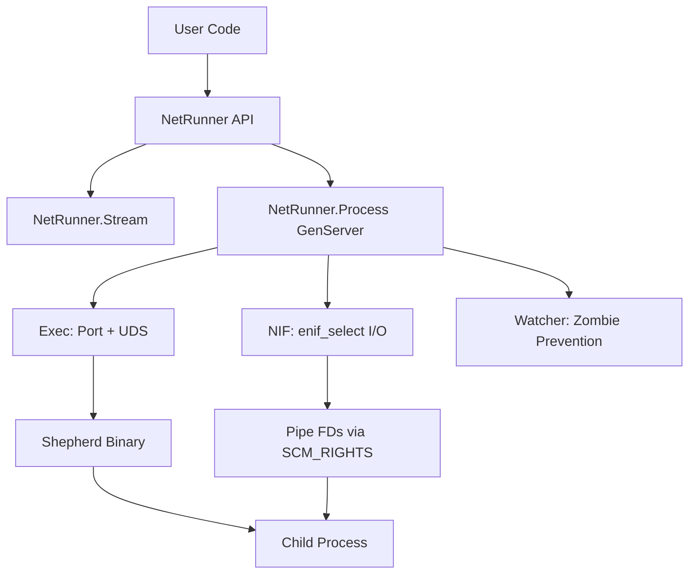
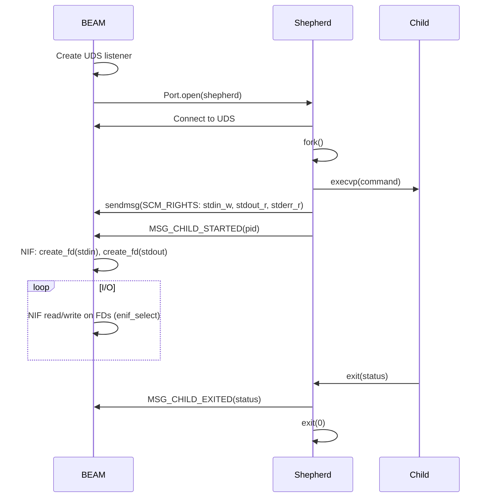
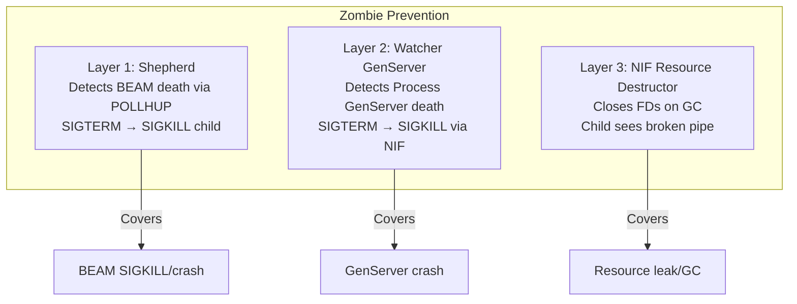

# NetRunner Architecture

## Overview

NetRunner provides safe OS process execution for Elixir by combining NIF-based async I/O with a persistent shepherd binary. This guarantees zero zombie processes, even when the BEAM is killed with SIGKILL.

## Component Diagram

## Process Spawn Sequence

## Zombie Prevention (3 Layers)

**Why all three layers?**

| Layer | Trigger | Mechanism | Covers |
|-------|---------|-----------|--------|
| Shepherd | BEAM process dies | UDS POLLHUP → kill child group | BEAM SIGKILL, OOM kill, segfault |
| Watcher | GenServer crashes | Process.monitor → NIF kill | Elixir-level crashes, unhandled errors |
| NIF destructor | FD resource GC'd | close(fd) → child SIGPIPE/EOF | Resource leaks, process table cleanup |

## I/O Architecture

All I/O goes through the NIF using `enif_select`, which integrates with the BEAM's epoll/kqueue event loop:

1. **Read**: NIF attempts `read(fd)`. If data available, returns immediately. If `EAGAIN`, registers `enif_select(READ)` and the GenServer parks the caller.
2. **Write**: NIF attempts `write(fd)`. Handles partial writes by retrying until `EAGAIN`, then parks.
3. **Ready notification**: BEAM sends `{:select, resource, ref, :ready_input/:ready_output}` to the GenServer, which retries parked operations.

All NIF functions run on dirty IO schedulers to prevent BEAM scheduler stalls.

## PTY Mode

When `pty: true` is passed:
- Shepherd calls `openpty()` instead of `pipe()`
- Child gets a controlling terminal (`setsid()` + `TIOCSCTTY`)
- Single bidirectional master FD is sent via SCM_RIGHTS
- BEAM dups the FD for independent stdin/stdout NIF resources
- `set_window_size/3` sends `CMD_SET_WINSIZE` to shepherd, which calls `ioctl(TIOCSWINSZ)`

## cgroup Support (Linux Only)

When `cgroup_path:` is set:
- Shepherd creates `/sys/fs/cgroup/{path}` directory
- Moves child PID to `cgroup.procs`
- On cleanup, writes `1` to `cgroup.kill` and removes the directory
- No-op on macOS/BSD

## Parallelism Model

Every NetRunner process is fully independent:
- Each command gets its own shepherd process, pipe FDs, and GenServer
- NIF functions run on BEAM's dirty IO scheduler pool (default 10 threads)
- `enif_select` integrates with BEAM's epoll/kqueue — handles thousands of concurrent FDs
- No global lock, no shared process manager
