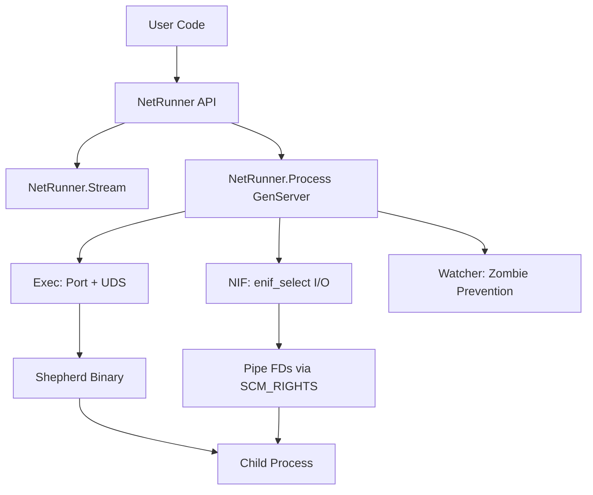
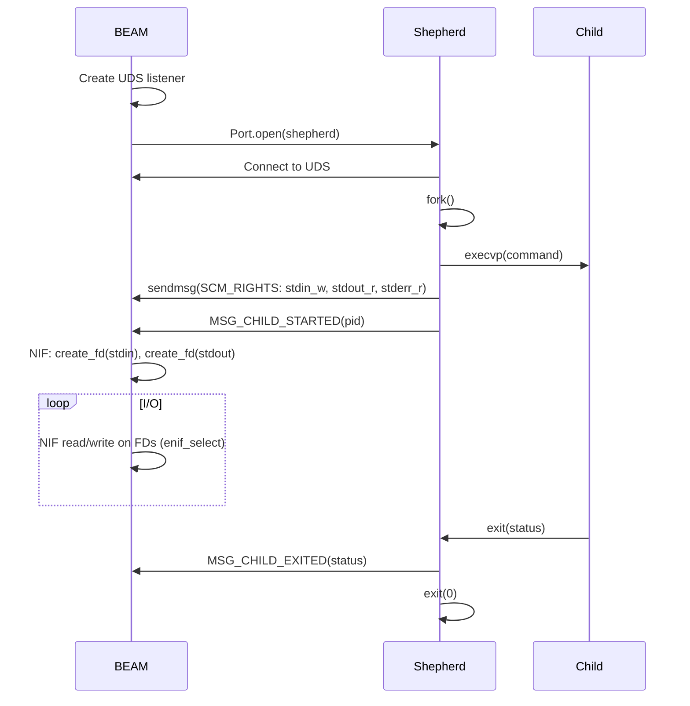
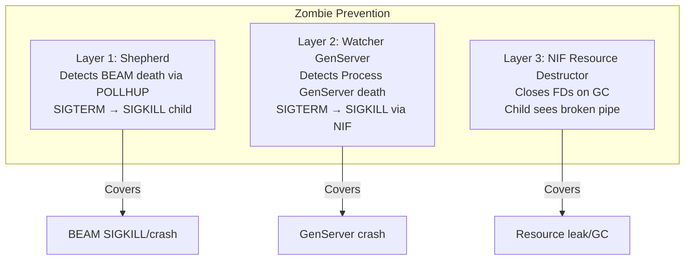

# NetRunner Architecture

## Overview

NetRunner provides safe OS process execution for Elixir by combining NIF-based async I/O with a persistent shepherd binary. This guarantees zero zombie processes, even when the BEAM is killed with SIGKILL.

## Component Diagram

```mermaid
graph TD
    A[User Code] --> B[NetRunner API]
    B --> C[NetRunner.Stream]
    B --> D[NetRunner.Process GenServer]
    D --> E[Exec: Port + UDS]
    D --> F[NIF: enif_select I/O]
    D --> G[Watcher: Zombie Prevention]
    E --> H[Shepherd Binary]
    H --> I[Child Process]
    F --> J[Pipe FDs via SCM_RIGHTS]
    J --> I
```

## Process Spawn Sequence

```mermaid
sequenceDiagram
    participant B as BEAM
    participant S as Shepherd
    participant C as Child

    B->>B: Create UDS listener
    B->>S: Port.open(shepherd)
    S->>B: Connect to UDS
    S->>S: fork()
    S->>C: execvp(command)
    S->>B: sendmsg(SCM_RIGHTS: stdin_w, stdout_r, stderr_r)
    S->>B: MSG_CHILD_STARTED(pid)
    B->>B: NIF: create_fd(stdin), create_fd(stdout)

    loop I/O
        B->>B: NIF read/write on FDs (enif_select)
    end

    C->>S: exit(status)
    S->>B: MSG_CHILD_EXITED(status)
    S->>S: exit(0)
```

## Zombie Prevention (3 Layers)

```mermaid
graph TD
    subgraph "Zombie Prevention"
        L1[Layer 1: Shepherd<br/>Detects BEAM death via POLLHUP<br/>SIGTERM → SIGKILL child]
        L2[Layer 2: Watcher GenServer<br/>Detects Process GenServer death<br/>SIGTERM → SIGKILL via NIF]
        L3[Layer 3: NIF Resource Destructor<br/>Closes FDs on GC<br/>Child sees broken pipe]
    end
    L1 -->|Covers| BEAM_CRASH[BEAM SIGKILL/crash]
    L2 -->|Covers| GS_CRASH[GenServer crash]
    L3 -->|Covers| LEAK[Resource leak/GC]
```

**Why all three layers?**

| Layer | Trigger | Mechanism | Covers |
|-------|---------|-----------|--------|
| Shepherd | BEAM process dies | UDS POLLHUP → kill child group | BEAM SIGKILL, OOM kill, segfault |
| Watcher | GenServer crashes | Process.monitor → NIF kill | Elixir-level crashes, unhandled errors |
| NIF destructor | FD resource GC'd | close(fd) → child SIGPIPE/EOF | Resource leaks, process table cleanup |

## I/O Architecture

All I/O goes through the NIF using `enif_select`, which integrates with the BEAM's epoll/kqueue event loop:

1. **Read**: NIF attempts `read(fd)`. If data available, returns immediately. If `EAGAIN`, registers `enif_select(READ)` and the GenServer parks the caller.
2. **Write**: NIF attempts `write(fd)`. Handles partial writes by retrying until `EAGAIN`, then parks.
3. **Ready notification**: BEAM sends `{:select, resource, ref, :ready_input/:ready_output}` to the GenServer, which retries parked operations.

All NIF functions run on **normal** schedulers. Every fd is set to `O_NONBLOCK`
by `nif_create_fd`, so every syscall is bounded and a dirty-scheduler handoff
would be pure overhead — see ADR-6 in `decisions.md` for the measurements.
`nif_read`/`nif_write` call `enif_consume_timeslice` in proportion to the bytes
they moved.

### `:input` is written concurrently with reading

Both `NetRunner.run/2` and `NetRunner.Stream` write stdin from a `Task` that
runs alongside the read loop, sharing one implementation in
`NetRunner.InputWriter`. This is not an optimisation, it is a liveness
requirement: writing input to completion first deadlocks any filter command
whose input exceeds `stdin_buffer + stdout_buffer`. The child fills its stdout
pipe, blocks in `write(2)`, therefore stops draining stdin, and the writer
blocks on a full stdin pipe. Neither side can make progress and `run/2`'s
default `:timeout` is `nil`, i.e. `:infinity`. `run/2` shipped with exactly
this bug until it was fixed; see the CHANGELOG.

The writer closes stdin exactly once, after the last chunk. It is reaped in
one place — joined when the reader reaches `:eof`, killed outright when the
reader halts early — because `Task.async` links, so an abnormal writer exit
already tears the caller down, but a `:normal` one would leave a parked writer
running.

## Spawn Cost: Two `exec`s, by Design

A NetRunner spawn is **two** `fork`+`exec` pairs, not one: the BEAM execs the
shepherd, and the shepherd forks and execs the command. Measured on an idle
Apple M1 Max, OTP 29:

| | |
|---|---|
| one `fork`+`exec` via `System.cmd/2` | 2532 µs |
| one `fork`+`exec` via raw `Port.open({:spawn_executable, …})` | 2655 µs |
| `NetRunner.run(["/usr/bin/true"])` end to end | 4.4–7.2 ms |

So ~5.3 ms is the floor for this design, and NetRunner sits on it. The second
`exec` is not overhead to be optimised away — it *is* the zero-zombie
guarantee, because the shepherd is what stays alive to watch for BEAM death
(ADR-1).

Everything addressable on the Elixir side of the spawn path was measured and
sums to about 1%: `File.dir?/1` 35 µs (0.8%), `:code.priv_dir` resolution 5 µs
(0.1%), `Watcher.watch/2` 6.8 µs (0.2%). The remaining ~87% is the
`:socket.accept` handshake wait, i.e. the shepherd's own `exec`.

**Do not re-open this as a regression.** The only thing that moves it is
amortisation — pooling or reusing shepherds — which is a design project with
real process-lifetime and privilege-boundary questions, not a perf task.
Reproduce with `MIX_ENV=prod mix run bench/exec_baseline.exs` and
`bench/spawn_breakdown.exs`. Note that shell loops are a useless baseline: they
fork a full shell before `exec` and measure ~13.8 ms/iteration.

## PTY Mode

When `pty: true` is passed:
- Shepherd calls `openpty()` instead of `pipe()`
- Child gets a controlling terminal (`setsid()` + `TIOCSCTTY`)
- Single bidirectional master FD is sent via SCM_RIGHTS
- BEAM dups the FD for independent stdin/stdout NIF resources
- `set_window_size/3` sends `CMD_SET_WINSIZE` to shepherd, which calls `ioctl(TIOCSWINSZ)`

## cgroup Support (Linux Only)

When `cgroup_path:` is set:
- Shepherd creates `/sys/fs/cgroup/{path}` directory
- Moves child PID to `cgroup.procs`
- On cleanup, writes `1` to `cgroup.kill` and removes the directory
- No-op on macOS/BSD

## Parallelism Model

Every NetRunner process is fully independent:
- Each command gets its own shepherd process, pipe FDs, and GenServer
- NIF functions run on the normal scheduler pool; no dirty-scheduler queue to contend for
- `enif_select` integrates with BEAM's epoll/kqueue — handles thousands of concurrent FDs
- No global lock, no shared process manager
