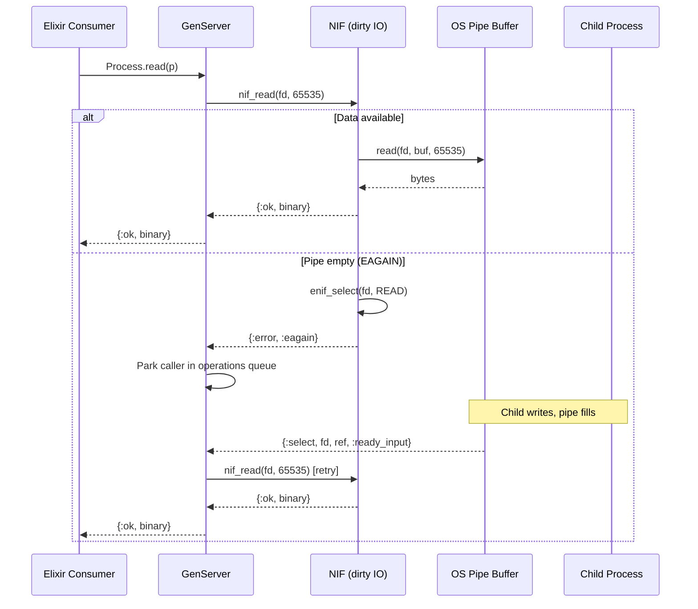

# Backpressure Deep-Dive

## The Problem

Erlang's built-in Port mechanism copies all data from the child's stdout into the BEAM's mailbox immediately. If a child produces data faster than Elixir code consumes it, the mailbox grows unbounded → OOM.

## NetRunner's Solution

NetRunner uses NIF-based I/O with `enif_select` to implement demand-driven backpressure. Data stays in the OS pipe buffer until explicitly read.

## How It Works

### Read Path

1. `Process.read/2` calls `GenServer.call(pid, {:read, :stdout, max_bytes}, :infinity)`
2. GenServer tries `Pipe.read(pipe, max_bytes)` → calls `Nif.nif_read(resource, max_bytes)`
3. NIF runs on dirty IO scheduler:
   - Calls `read(fd, buf, max_bytes)`
   - If data available: returns `{:ok, binary}` immediately
   - If `EAGAIN`: calls `enif_select(fd, ERL_NIF_SELECT_READ)`, returns `{:error, :eagain}`
4. On `EAGAIN`, GenServer parks the caller in the operations queue
5. When data arrives, BEAM's event loop detects fd readiness via epoll/kqueue
6. BEAM sends `{:select, resource, ref, :ready_input}` to GenServer
7. GenServer retries all parked read operations

### Write Path

1. `Process.write/2` calls `GenServer.call(pid, {:write, data}, :infinity)`
2. GenServer enters `write_loop`:
   - `Pipe.write(pipe, data)` → `Nif.nif_write(resource, data)`
   - If fully written: returns `:ok`
   - If partial write: retries immediately with remaining data
   - If `EAGAIN`: parks caller, waits for `{:select, ..., :ready_output}`
3. Partial writes are retried immediately because the kernel may have room for more

### Why Partial Write Retry Matters

Without immediate retry, a partial write would park the caller, but `enif_select` might not fire again because the pipe buffer isn't actually full — the NIF just happened to write less than requested. The write loop ensures we keep writing until we either:
- Complete the write (all bytes sent)
- Get `EAGAIN` (pipe buffer truly full → `enif_select` registered → will get notified)

## Pipe Buffer Sizes

The OS pipe buffer acts as the natural flow control mechanism:

| Platform | Default Pipe Buffer | Effect |
|----------|-------------------|--------|
| Linux | 64 KB (configurable up to 1 MB via `fcntl(F_SETPIPE_SZ)`) | Child blocks on `write()` when buffer full |
| macOS | 64 KB | Same blocking behavior |

When the Elixir consumer stops reading:
1. OS pipe buffer fills up
2. Child's `write()` call blocks (kernel-level backpressure)
3. Child naturally slows down or stops producing
4. No memory growth on the BEAM side

## Comparison with Alternatives

| Approach | Backpressure | Memory Safety |
|----------|-------------|---------------|
| `System.cmd` / Ports | None — mailbox flooding | OOM on fast producers |
| `Exile` | Yes — NIF + enif_select | Safe |
| `MuonTrap` | None — Port-based | OOM on fast producers |
| `erlexec` | Limited — single port bottleneck | Bottleneck limits throughput |
| **NetRunner** | Yes — NIF + enif_select | Safe |
