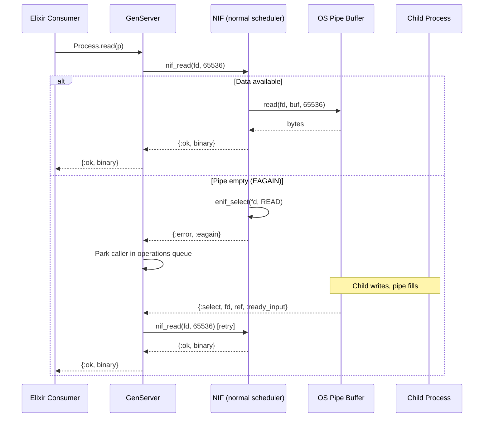

# Backpressure Deep-Dive

## The Problem

Erlang's built-in Port mechanism copies all data from the child's stdout into the BEAM's mailbox immediately. If a child produces data faster than Elixir code consumes it, the mailbox grows unbounded → OOM.

## NetRunner's Solution

NetRunner uses NIF-based I/O with `enif_select` to implement demand-driven backpressure. Data stays in the OS pipe buffer until explicitly read.

```mermaid
sequenceDiagram
    participant E as Elixir Consumer
    participant GS as GenServer
    participant NIF as NIF (normal scheduler)
    participant Pipe as OS Pipe Buffer
    participant Child as Child Process

    E->>GS: Process.read(p)
    GS->>NIF: nif_read(fd, 65536)
    alt Data available
        NIF->>Pipe: read(fd, buf, 65536)
        Pipe-->>NIF: bytes
        NIF-->>GS: {:ok, binary}
        GS-->>E: {:ok, binary}
    else Pipe empty (EAGAIN)
        NIF->>NIF: enif_select(fd, READ)
        NIF-->>GS: {:error, :eagain}
        GS->>GS: Park caller in operations queue
        Note over Pipe,Child: Child writes, pipe fills
        Pipe-->>GS: {:select, fd, ref, :ready_input}
        GS->>NIF: nif_read(fd, 65536) [retry]
        NIF-->>GS: {:ok, binary}
        GS-->>E: {:ok, binary}
    end
```

## How It Works

### Read Path

1. `NetRunner.Process.read/2` calls `GenServer.call(pid, {:read, :stdout, max_bytes}, :infinity)`
2. GenServer tries `Pipe.read(pipe, max_bytes)` → calls `Nif.nif_read(resource, max_bytes)`
3. NIF runs on a normal scheduler (see ADR-6); `max_bytes` defaults to
   `65_536`, exactly one pipe buffer and exactly the NIF's stack-buffer size
   (see ADR-9):
   - Calls `read(fd, buf, max_bytes)`
   - If data available: returns `{:ok, binary}` immediately
   - If `EAGAIN`: calls `enif_select(fd, ERL_NIF_SELECT_READ)`, returns `{:error, :eagain}`
4. On `EAGAIN`, GenServer parks the caller in the operations queue
5. When data arrives, BEAM's event loop detects fd readiness via epoll/kqueue
6. BEAM sends `{:select, resource, ref, :ready_input}` to GenServer
7. GenServer retries all parked read operations

### Write Path

1. `NetRunner.Process.write/2` calls `GenServer.call(pid, {:write, data}, :infinity)`
2. GenServer enters `write_loop`:
   - `Pipe.write(pipe, data)` → `Nif.nif_write(resource, data)`
   - If fully written: returns `:ok`
   - If partial write: retries immediately with remaining data
   - If `EAGAIN`: parks caller, waits for `{:select, ..., :ready_output}`
   - After `@write_budget` (16) `write(2)` calls in one pass: parks the caller
     with the remaining bytes and self-sends `:continue_writes`
3. Partial writes are retried immediately because the kernel may have room for more
4. The budget yield keeps a fast-draining child from letting one large payload
   occupy the GenServer for its whole duration — queued calls (`kill/2`,
   `read/2`, another caller's `write/2`) run between passes. Progress never
   depends on a readiness event that was never registered: the resume comes
   from the mailbox, not from `enif_select`.

### Why Partial Write Retry Matters

Without immediate retry, a partial write would park the caller, but `enif_select` might not fire again because the pipe buffer isn't actually full — the NIF just happened to write less than requested. The write loop ensures we keep writing until one of its three exits:
- Complete the write (all bytes sent)
- Get `EAGAIN` (pipe buffer truly full → `enif_select` registered → will get notified)
- Exhaust the 16-call `@write_budget` (caller parked → resumed via a
  self-sent `:continue_writes` message)

A consequence of the third exit: a payload is **not atomic** against
concurrent writers. A budget yield (or a full-pipe park) lets another
caller's write splice between this payload's chunks — documented on
`NetRunner.Process.write/2`; serialise externally (as `Daemon` does via its
forwarder) when payload atomicity matters. See `write_loop/5` in
`lib/net_runner/process.ex`.

## Pipe Buffer Sizes

The OS pipe buffer acts as the natural flow control mechanism:

| Platform | Pipe Buffer | Effect |
|----------|-------------|--------|
| Linux | 1 MB — the shepherd grows each pipe from the 64 KB default via `fcntl(F_SETPIPE_SZ, 1 << 20)` (best effort; capped by `/proc/sys/fs/pipe-max-size` and may be refused for unprivileged processes, in which case 64 KB stands) | Child blocks on `write()` when buffer full |
| macOS | 64 KB (no equivalent knob) | Same blocking behavior |

The Linux growth is a throughput optimisation: every buffer-sized chunk costs
the BEAM a read → `EAGAIN` → `enif_select` → message round trip, so a 16x
bigger buffer cuts round trips per MiB by ~16x. Reads still happen 64 KB at a
time (`@default_read_size`, sized to the NIF's stack fast path) — a saturated
1 MB pipe simply drains over ~16 consecutive reads.

When the Elixir consumer stops reading:
1. OS pipe buffer fills up
2. Child's `write()` call blocks (kernel-level backpressure)
3. Child naturally slows down or stops producing
4. No memory growth on the BEAM side

## Comparison with Alternatives

| Approach | Backpressure | Memory Safety |
|----------|-------------|---------------|
| `System.cmd` / Ports | None — mailbox flooding | OOM on fast producers |
| `Exile` | Yes — NIF + enif_select | Safe |
| `MuonTrap` | None — Port-based | OOM on fast producers |
| `erlexec` | Limited — single port bottleneck | Bottleneck limits throughput |
| **NetRunner** | Yes — NIF + enif_select | Safe |
