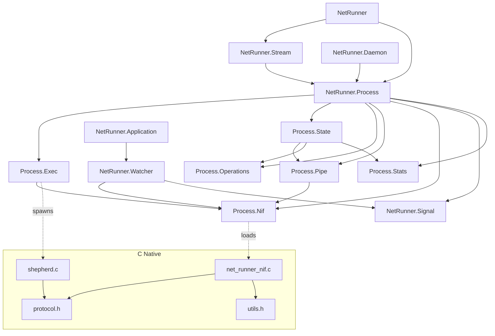

# Module Dependency Diagram

## Module Reference

### Public API

| Module | Purpose |
|--------|---------|
| `NetRunner` | Top-level API: `run/2`, `stream!/2`, `stream/2` |
| `NetRunner.Process` | GenServer managing a single OS process lifecycle |
| `NetRunner.Stream` | `Stream.resource` wrapper for incremental I/O |
| `NetRunner.Daemon` | Supervised long-running process for supervision trees |
| NetRunner.Signal | Signal atom → platform-specific number resolution |

### Internal Modules

| Module | Purpose |
|--------|---------|
| NetRunner.Process.Exec | Process spawning: UDS, Port.open, SCM\_RIGHTS, FD wrapping |
| NetRunner.Process.Nif | NIF function stubs (@on\_load :load\_nifs) |
| NetRunner.Process.Pipe | Pipe struct wrapping a NIF FD resource |
| NetRunner.Process.State | GenServer state struct |
| NetRunner.Process.Operations | Pending operation queue (park on EAGAIN, retry on ready) |
| NetRunner.Process.Stats | I/O statistics accumulator |
| NetRunner.Watcher | DynamicSupervisor child that kills OS process on GenServer death |
| NetRunner.Application | OTP application: starts WatcherSupervisor |

### C Components

| File | Lines | Purpose |
|------|-------|---------|
| `c_src/shepherd.c` | ~600 | Persistent child watchdog: fork, FD pass, poll loop, kill escalation, PTY, cgroup |
| `c_src/net_runner_nif.c` | ~480 | NIF: read/write/close/create_fd/dup_fd/kill/signal_number with enif_select |
| `c_src/protocol.h` | ~35 | Shared protocol constants |
| `c_src/utils.h` | ~20 | Debug/error macros |
