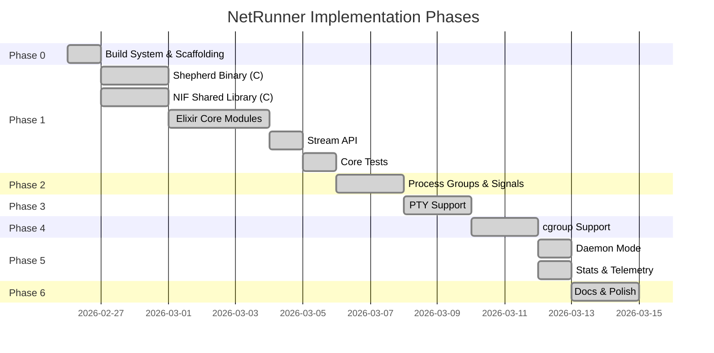

# Implementation Phases

## Roadmap

## Phase 0: Build System Scaffolding

- `mix.exs` with `elixir_make` compiler
- `Makefile` with platform detection (macOS/Linux)
- `protocol.h` and `utils.h` shared headers
- `.gitignore` for build artifacts

## Phase 1: Core System (MVP)

**C code:**
- `shepherd.c`: fork, pipe creation, SCM_RIGHTS FD passing, poll() event loop, signal handling via self-pipe trick
- `net_runner_nif.c`: `nif_read/write/close/create_fd/kill/is_os_pid_alive`, all on dirty IO schedulers, `enif_select` for async readiness

**Elixir modules:**
- `Nif`, `Signal`, `Pipe`, `State`, `Operations`, `Exec`, `Process`, `Watcher`, `Application`, `Stream`, `NetRunner`

**Tests:**
- Basic I/O, close stdin, exit status, kill, streaming, zombies

## Phase 2: Process Groups + Signal Enhancements

- `setpgid(0,0)` in child, `kill(-pgid, sig)` for grandchild cleanup
- Configurable kill escalation timeout (`--kill-timeout` CLI arg)
- `nif_signal_number/1` using C `<signal.h>` for platform-correct numbers
- `run/2` options: `:timeout`, `:max_output_size`

## Phase 3: PTY Support

- `openpty()` in shepherd with platform-specific headers
- `setsid()` + `TIOCSCTTY` for controlling terminal
- Single master FD passed via SCM_RIGHTS, duped for independent stdin/stdout
- `CMD_SET_WINSIZE` (0x03) with `ioctl(TIOCSWINSZ)`
- `set_window_size/3` API

## Phase 4: cgroup Support (Linux Only)

- `#ifdef __linux__` cgroup v2 integration in shepherd
- Create cgroup directory, move child PID to `cgroup.procs`
- Kill all procs via `cgroup.kill` on cleanup, rmdir
- `--cgroup-path` CLI arg, `:cgroup_path` Elixir option
- No-op stubs on macOS/BSD

## Phase 5: Daemon Mode + Stats

**Daemon:**
- `NetRunner.Daemon` GenServer wrapping Process
- Supervised long-running processes with `start_link/1`
- Auto-drains stdout/stderr via Task to prevent pipe blocking
- Graceful shutdown in `terminate/2`
- Options: `cmd:`, `args:`, `on_output:` (`:discard` | `:log` | fun/1)

**Stats:**
- `NetRunner.Process.Stats` struct in GenServer state
- Tracks: bytes_in/out/err, read/write count, started_at, duration_ms, exit_status
- Zero-cost integer counters incremented on each read/write
- Finalized on process exit

## Phase 6: Documentation

Comprehensive `docs/` directory with Mermaid diagrams covering architecture, protocol, decisions, modules, backpressure, comparison, and phases.

## Phase 7: Polish

- `@moduledoc` for all public modules
- `ex_doc` and `dialyxir` dependencies
- Hex package metadata
